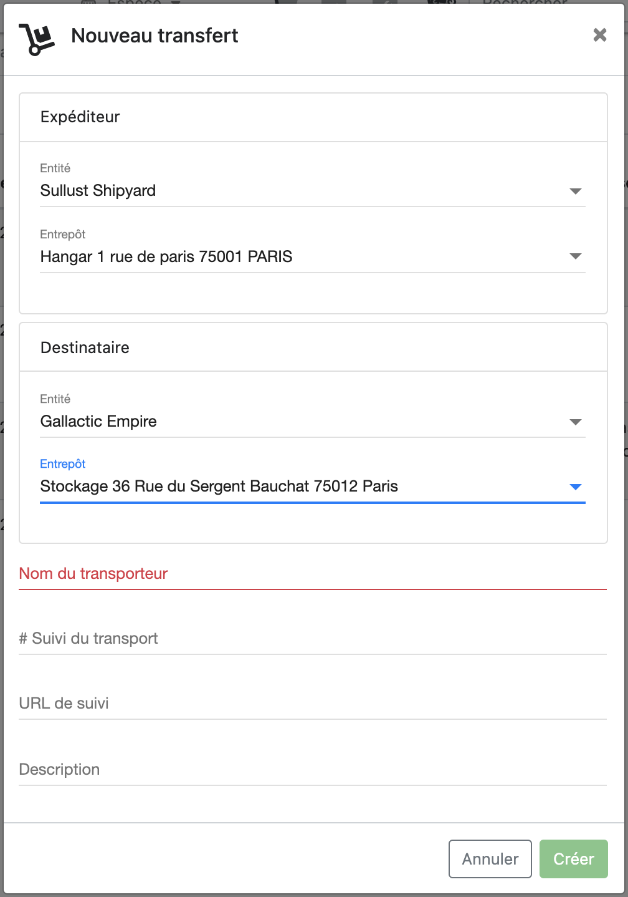
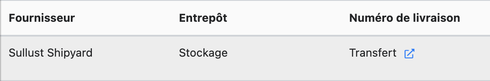

# Février 2022 - Version 1.18.0

# Transferts inter-entité

Il est désormais possible de faire des transferts de stock entre différentes entités.

## Liste des transferts

La liste des transferts recense les transferts depuis ou vers cette entité (y inclus les transferts intra-entité). Dans le cas d'un transfert inter-entité, le nom de l'entité est affiché en gras.

## Liste des réceptions

* Nous avons inversé les colonnes "Fournisseur" et "Entrepôt" de la liste des réceptions: la lecture est plus naturelle puisque le "Fournisseur" est l'expéditeur et "Entrepôt" la destination. Cela correspond aussi davantage à ce qui est représenté côté Transferts.
* Lorsqu'une réception est une réception d'un transfert inter-entité, nous n'affichons pas le nom de l'entrepôt comme "Fournisseur" mais seulement le nom de l'entité.
* Lorsqu'une réception est une réception d'un transfert, nous avons remplacé le numéro de livraison (qui correspondait à un identifiant interne du transfert) par un lien vers le transfert.

# Améliorations diverses

- Vous pouvez désormais modifier les tags d'un contact.

# Améliorations sur comptabilité:

## Gestion des dates d'échéance par fournisseur

## Nous avons ajouté des règles de comptabilité spécifiques pour les factures d'achat.

## Amélioration de l'export automatique comptable

## C'est corrigé

-
