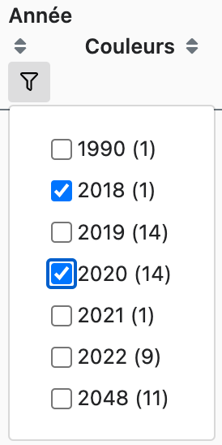
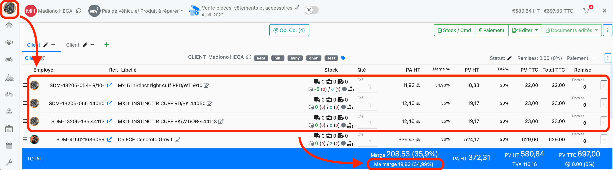
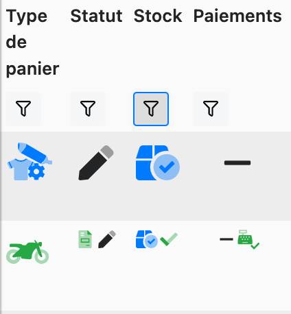
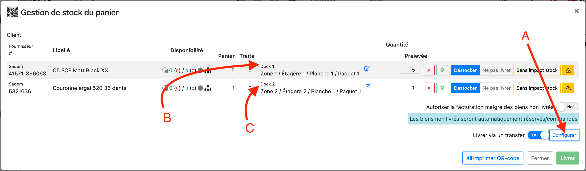
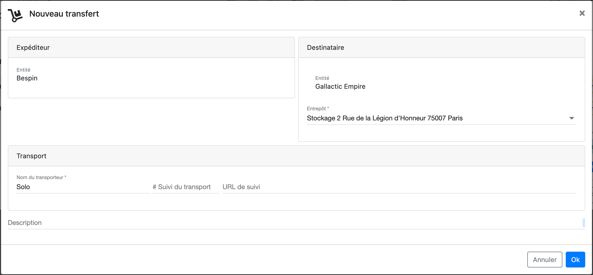
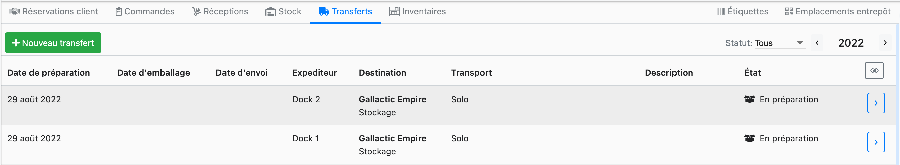
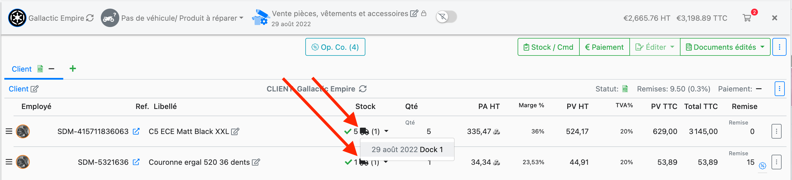

# Aout 2022 - Version 1.32.0

## Recherches

<!-- [DMS-2956][DMS-3189] Implement multi-select search aggregat… Madian            2 days -->

Nous avons amélioré la recherche dans l'application: il est désormais possible de filtrer sur plusieurs choix d'un même type (par exemple de rechercher tous les dossiers de 2018 et 2020 comme illustré ci-dessous).

## Panier

<!-- [DMS-3102] As User I want to be able to see "My Margin" on … Madian            26 days -->

### Ma Marge

Vous aviez l'habitude de voir la marge réalisée par l'entreprise sur le panier. Lorsque plusieurs utilisateurs ont modifié un même panier, la marge réalisée grâce à l'utilisateur courant est désormais affichée comme "Ma marge" en dessous de la marge globale du panier.

### Statut des paniers

- Le statut de stock des paniers est maintenant reporté par groupe de facturation.
- Sur la liste des paniers, les différents status des groupes de facturations sont affichés : par exemple, ci-dessous, la première ligne indique que tous les groupes de facturation du panier sont "ouverts", "préparés" et "sans paiement"; la deuxième ligne indique que les groupes de facturation sont tous "facturés ou ouvert", "préparé ou traité", "sans paiement ou payés".

<!-- [DMS-3114] Allow multi-filtering on basket screen.           Luc Boutier       14 days -->
<!-- [DMS-3114] Allow multi-state filters on basket status (cust… Luc Boutier       14 days -->
<!-- [DMS-3114] Improve disable tooltip on basket enum icon comp… Luc Boutier       14 days -->
<!-- [DMS-3169] Move basket stock status in billing groups.       Matthieu Boutier  13 days -->

Remarquez au passage que, comme déjà mentionné, la recherche permet de filtrer plusieurs status du même type (par exemple tous les paniers avec du stock préparé ou réservé).

## Transferts entre compagnies ou succursales.

<!-- [DMS-3117] Add link to transfer on basket line.              Luc Boutier       16 days -->
<!-- [DMS-3117] Add transfer state and color to basket view.      Matthieu Boutier  7 days -->
<!-- [DMS-3117] Allow to deliver basket as a transfer.            Luc Boutier       22 days -->
<!-- [DMS-3117] Allow to edit transfer barcodes in preparing and… Matthieu Boutier  9 days -->
<!-- [DMS-3117] Cache accountancy documents (not pdfs).           Matthieu Boutier  7 days -->
<!-- [DMS-3117] Do not revert transfered stock on document cance… Matthieu Boutier  2 days -->
<!-- [DMS-3117] Fix initializing (non-transfer) receptions.       Matthieu Boutier  9 days -->
<!-- [DMS-3117] Fixes around transfers.                           Matthieu Boutier  9 days -->
<!-- [DMS-3117] Minor refactorings of transfer list component.    Matthieu Boutier  2 days -->
<!-- [DMS-3117] Update transfer and customer order reservation m… Luc Boutier       21 days -->

Il est enfin possible de suivre le transfert de stock résultant d'une ventre entre vos compagnies ou succursales.

Pour cela, faites comme d'habitude votre panier avec comme client la société qui devra recevoir le stock. Vous pouvez préparer le stock en utilisant les fonctionnalités habituelles du panier. Notez que ce processus vous permet donc aussi de commander une pièce pour une autre de vos sociétés tout en gardant la traçabilité complète de la commande jusqu'au transfert.

Enfin, pour réaliser le transfert, il vous suffit d'éditer votre facture (ou un bon de livraison). La fenêtre de gestion du stock s'ouvrira, comme d'habitude, avec une nouvelle option pour configurer (ou désactiver) le transfert (cf. **A** sur l'image "Gestion de stock du panier"). les informations de transfert (cf. **A** sur l'image "Gestion de stock du panier" et l'image "Nouveau transfert"). Lorsque vous cliquez sur "Livrer", un transfert sera créé d'où le stock est prélevé. Dans l'exemple ci-dessous, le premier produit est prélevé de l'entrepôt _Dock 1_ et le deuxième produit est prélevé de l'entrepôt _Dock 2_.

Puisque nous avons configuré nos transferts pour qu'ils soient livrés à l'entrepôt _Stockage_, nous avons bien deux nouveaux transferts (créés après édition de la facture).

Côté panier, il est possible d'accéder aux transferts correspondant aux différentes lignes depuis l'affichage de statut de stock.

## Comptabilité

<!-- [DMS-2958] Add name of the cashdesk to the cashdesk events … Luc Boutier       14 days -->

Le nom de la caisse a été ajoutée à l'écran des détails journaliers.

## Corrections

<!-- [DMS-3134] Fix vehicle basket total in customer basket list… Luc Boutier       22 days -->
* Correction du total des paniers véhicules sur l'écran de liste des paniers.
<!-- [DMS-3153] Fix to refresh basket payment status              Victor Keophila   21 days -->
* Correction du rafraichissement des status de paiement des paniers.
<!-- [DMS-3161] Changing warehouse to nothing trigger bad reques… VU Minh Khang     13 days -->
* Il n'est plus possible de supprimer l'emplacement entrepôt d'un dossier.

<!-- TODO -->
<!-- [DMS-2963] Add more validation                               Luc Boutier       19 days -->
<!-- [DMS-2963] Fix bug refund not available anymore              VU Minh Khang     19 days -->
<!-- [DMS-2963] Improve error message on payment with negative a… Luc Boutier       19 days -->

<!-- [DMS-2998] Remove payment type with delayed reclaim on the … Victor Keophila   7 days -->

<!-- [DMS-3131] Review, add filter on "Ajouter un dossier" butto… Guillaume Chaput  13 days -->

<!-- [DMS-3162] On a partial invoice delivery, all other product… Guillaume Chaput  25 days -->
<!-- [DMS-3169] Add a fixme and fix compilation.                  Matthieu Boutier  13 days -->
<!-- [DMS-3169] Fix display of indexed basket statuses.           Matthieu Boutier  12 days -->
<!-- [DMS-3186] Keep filters configuration locally.               Luc Boutier       15 days -->
<!-- [DMS-3197] Add due date column on journal writing view & ex… Victor Keophila   7 days -->
<!-- [DMS-3197] Fix month value of due dates which should be bet… Victor Keophila   7 days -->
<!-- [DMS-3207] Fix saving analytics options.                     Matthieu Boutier  20 hours -->

<!-- Activate eslint no-shadow and fix all code.                  Matthieu Boutier  1 month -->
<!-- Add lazy subjects to fetch basket documents.                 Matthieu Boutier  2 days -->
<!-- Add new StockEvent fields                                    Guillaume Chaput  14 days -->
<!-- Add validation when editing invoice.                         Luc Boutier       22 days -->
<!-- Allow LazyReplay1Subject to refetch its input mono.          Matthieu Boutier  2 days -->
<!-- Allow not to revert stock on invoice and delivery note canc… Matthieu Boutier  2 days -->
<!-- Allow to copy the new quantity of inventory lines on the fi… Victor Keophila   22 days -->
<!-- Allow to revert stock processing to match documents.         Matthieu Boutier  2 days -->
<!-- Cleanup                                                      Luc Boutier       13 days -->
<!-- Define a custom type for typing OnChanges.                   Matthieu Boutier  7 days -->
<!-- Deprecate SimpleChanges and OnChanges.                       Matthieu Boutier  7 days -->
<!-- Do type all on changes.                                      Matthieu Boutier  7 days -->
<!-- Editing delivery notes and invoices now fixes stock desynch… Matthieu Boutier  2 days -->
<!-- Fix all '==' and '!=' occurrences.                           Matthieu Boutier  1 month -->
<!-- Fix basket booking state.                                    Matthieu Boutier  13 days -->
<!-- Fix basket select modal when filtering trade-ins.            Matthieu Boutier  12 days -->
<!-- Fix delivery note edition with "process ignored".            Matthieu Boutier  5 days -->
<!-- Fix fetching incoming warehouse names of transfers.          Matthieu Boutier  9 days -->
<!-- Fix few typing issues.                                       Matthieu Boutier  9 days -->
<!-- Fix filter label for basket template.                        Luc Boutier       20 days -->
<!-- Fix having two times "ADMIN" in user auths.                  Matthieu Boutier  15 hours -->
<!-- Fix honda import                                             Luc Boutier       22 days -->
<!-- Fix item list category filter dropdown container             Luc Boutier       8 days -->
<!-- Fix item stock event loading.                                Luc Boutier       21 days -->
<!-- Fix onChanges checks.                                        Matthieu Boutier  7 days -->
<!-- Fix render of barcode prints for QRCodes                     Luc Boutier       21 days -->
<!-- Fix stock event loading on item detail page.                 Matthieu Boutier  9 days -->
<!-- Fix variable renaming                                        Victor Keophila   8 days -->
<!-- Fix wrong purchase price re-computation on price update.     Luc Boutier       20 days -->
<!-- Make the dealer file's "select purchase info" button do som… Matthieu Boutier  12 days -->
<!-- Minor fixes.                                                 Luc Boutier       22 days -->
<!-- Minor improvement to search utils for simpler query when po… Luc Boutier       8 days -->
<!-- Minor refactoring of payment modal.                          Luc Boutier       21 days -->
<!-- Refactoring of basket header                                 Luc Boutier       20 days -->
<!-- Refactoring of entity prices endpoint from patch to post.    Luc Boutier       12 days -->
<!-- Refactoring: move to account principal the entity relations… Luc Boutier       22 days -->
<!-- Remove console.log                                           Luc Boutier       20 days -->
<!-- Rename dms-customer-bsk-action-buttons to dms-customer-bsk-… Luc Boutier       20 days -->
<!-- Revert check added due to wrong comment                      Luc Boutier       19 days -->
<!-- Rework BufferedSubject to allow Flux in input.               Matthieu Boutier  8 days -->
<!-- Rework contact list to use standard pipes to build treeview… Luc Boutier       21 days -->
<!-- Sort product delta-events: first outgoing events.            Matthieu Boutier  2 days -->
<!-- Use map to store LocalConfig                                 Guillaume Chaput  16 days -->
<!-- Warn the user that documents and stock are desynchronized.   Matthieu Boutier  2 days -->
