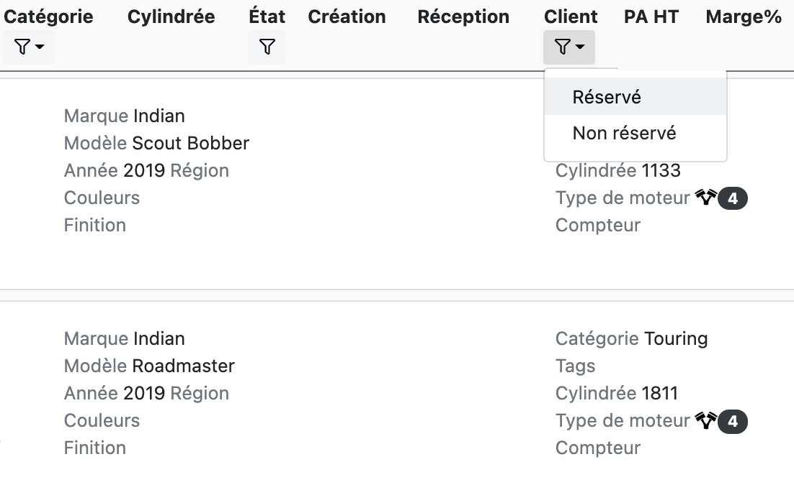

# Août 2021 - Version 1.9.0

- Lorsque vous créez un nouveau rendez-vous à l'aide de la fonction de prise de rendez vous rapide le titre du panier créé est désormais celui du modèle choisi, ou, dans le cas d'une description libre, la première ligne de cette description.
- Le nom de modèle d'un véhicule est maintenant éditable.

## Modification des catégories de produit

Nous avons séparé la catégorie "Autres services et taxes" en "Autres services" d'une part et "Autres taxes" d'autre part afin d'automatiser, dans le futur, l'application de la TVA à ces catégories. Toutefois, le processus de renommage ne peut pas être totalement automatisé et requiert votre attention.

Nous avons renommé la catégorie _Autres services et taxes_ en _Autres services_ dans tous les catalogues, mais nous n'avons pas effectué de renommage ailleurs, et en particulier dans les règles de comptabilité. Nous vous demandons donc :

  <ul>
    <li>
      de bien vérifier vos règles de comptabilité (Comptabilité > Configuration des comptes) 
      
    </li>
    <li>de bien vérifier que les catégories des produits dans les paniers ouverts existants sont correctes</li>
    <li>
      de bien vérifier que les produits désormais dans "Autres services" ne devraient pas être dans "Autres taxes" (vous pouvez utiliser le filtre comme ci-dessous) 
      
    </li>
  </ul>

## Contacts

### Numéro d'immatriculation des véhicules

- Le numéro d'immatriculation des véhicules du client sont désormais affichés.

### Exoneration de TVA

Lors e la création ou modification d'un client, il est maintenant possible de sélectionner "Exonéré de TVA" si vous avez un role de type "ACCOUNTANT"
, "ADMIN" ou "SALES_MANAGER".
Un client éxonéré d TVA aura sa TVA mise à 0% par défaut lors de l'ajout d'élément à un panier.

## Stock négatif

Dans Stock -> Onglet Stock, il a maintenant un nouveau bouton "Stock négatif" permettant d'afficher tout les produits ayant un stock négatif dans au moins un lieu.

## Surcharge de prix

Il est possible de surcharger le prix d'un vehicule, lorsqu'il n'appartient pas à une concession.

## Filtrer les véhicules réservés

Il est désormais possible de filtrer les véhicules réservés.

## Date de facture d'achat

Dans la fiche de véhicule, vous pouvez dorénavant retrouver et modifier la date de facture d'achat.

## Impression de réceptions

Vous pouvez désormais utiliser le bouton _Imprimer_ sur une réception cloturée afin d'en imprimer le listing.

## Sélection dans les listes de produit et véhicule

La navigation dans les listes de produit et véhicules a été améliorée; Vous pouvez cliquer à n'importe quel endroit de la ligne pour accéder au détail. La selection de texte (description, référence) reste possible soit par double click soit en sélectionnant une sous-partie de celui-ci avec la souris.

## Améliorations sur la barre de recherche globale

La recherche globale a été améliorée pour plus de comfort. La recherche est désormais effecutée à travers:

- Les dossiers véhicules
- Les contacts
- Les produits

Nous avons également apporté les améliorations ergonomiques suivantes:

- Le résultat le plus probable est affiché en haut de liste et est surligné; il peut-être immédiatement accédé en appuyant sur la touche _entrée_ du clavier.
- Vous pouvez naviguer entre les résultats à l'aide des touches de navigation du clavier (et utiliser la touche _entrée_ pour accéder le résultat en surbrillance).
- Vous pouvez accéder l'écran de recherche des dossiers/contacts/produits incluant la recherche entrée en utilisant les fonctions _Recherche avancée_ et bénéficier ainsi de fonctions de recherche plus avancées.

Notez que la recherche d'un véhicule dans les systèmes constructeurs ou par plaque d'immatriculation n'est activée qu'avec un minimum de 6 charactères mais:

- Seul Triumph supporte actuellement la recherche de VIN avec les 6 derniers charactères.
- Une immatriculation ou un VIN pour les autres constructeurs doivent être obligatoirement entrés en entier.

## Renommage du label 'En attente de livraison'

- Le label 'En attente de livraison' a été renommé par le label 'En attente du fournisseur' respectivement dans l'ecran d'affichage du calendrier en vue kanban et dans la modal d'édition d'une tâche.

# C'est corrigé

- Correction d'un problème de focus lors de l'édition d'un libellé sur une ligne du panier.
- Correction d'un problème lorsqu'on duplique une règle dans la configuration des comptes.
- Correction du filtre de recherche sur les catégories de produit qui ne retournait pas toujours les bons résultats.
- Correction d'une erreur lorsqu'on crée un groupe de facturation lorsqu'il n'y en a aucun dans le panier.
- Ajout d'une traduction manquante pour le message d'erreur de l'édition d'une facture de cession avec des remises.
- Diverses corrections lors de la suppression ou annulation d'un groupe de facturation.
- La TVA est maintenant correctement mis à jour lors qu'on déplace une produit non-stokable dans ou en dehors d'un groupe de cession.
- Correction de la page indéfiniment en attente lors qu'on essaie d'éditer un bon d'achat à partir d'un dossier de véhicule.
- Impossible d'ajouter une ligne à un panier de type O.R. converti en PG&A avec une tâche d'atelier annulée.

# Application mobile

- Certains codes barres sont préfixés ou suffixés par des espaces. Ils sont désormais automatiquement supprimés lors d'un scan.
- Les tâches sont colorisées comme sur l'application de bureau.
